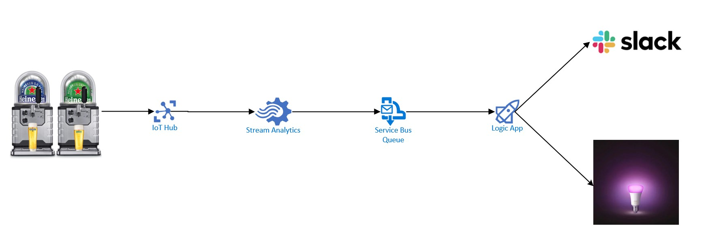

# Actioning  on IoT data

In this part we will make our data from the Beertaps actionable. What we will do is change the light of a hue bulb every time someone is tapping a beer and send a notification to Slack.

What services in Azure are Used:
- IoT-Hub
- Azure Stream Analytics Job
- Azure Service Bus Queue
- Logic App
- Supporting services (like VNET's, storage accounts etc.)

## Small Architecture sketch

## Setup per table
Each Table has its own resource group with all the per-table shared azure resources (e.g. IoTHub and Grafana)
You can find credentials that you can use to login to portal.azure.com on each table.
Please do not deploy additional IoT Hubs, as they won't be able to receive data from the Beer taps. Each deployed IoT Hub needs to be configured on the Beer Taps and the ones we deployed have been configured on our Beer Taps.

Each Table also has a Philips Hue colour bulb, these bulbs are all named after planets from the Star Wars Universe. There is a sticker on the bulb indicating the name of the bulb. These bulbs are attached to a Hue Bridge that we have setup along with an API that is running in an Azure App Service.

## Setup per Workshop attendeed
Each workshop attendee wil also receive an own Resource group in which he/she can deploy the neccesary resources. The resource group that belongs to you can be found on the table as well.
Please do not deploy things to resource groups that are not your own. Thank you on behalf of your fellow workshop mates for understanding ;)

## What You will Create
1. Extend the Stream Analytics Job from the previous part of the Workshop
2. A Azure Service Bus Queue to send the "Hot" data to
3. A Logic App that reads from the queue and sends a notification to slack and sends an API call to the Hue Bridge

