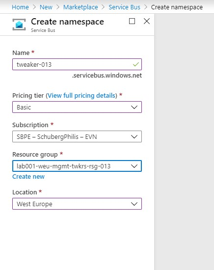
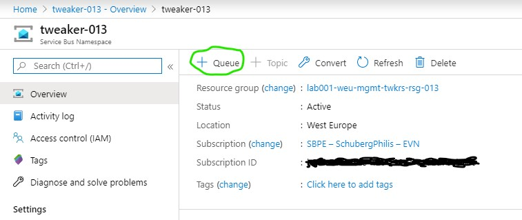

# Step 5 Create an Azure Service Bus Queue

So now that we did some reporting visualizations on our data, lets do some actionable stuff with our data.
The goal is to make a Philips Hue bulb change light colours whenever someone is tapping a beer.

To achieve this we need to add an additional output to the Stream Analytics Job. This will basically create a HOT Path, where the Database outputs represent the COLD Path.
This new output will be an Azure Service Bus Queue, this queue will be read by a Logic App later on.

## Create the Service Bus Namespace
In order to be able to create a queue, you will first need a Namespace.
1. Click on **Create a resource**
2. Search the Marketplace for "Service Bus"
3. Select "Service Bus" and click on **Create**
4. Fill in the following fields:
  * **Name**: Fill in a name that you can remember(suggestion *tweaker-xxx* where xxx is your assigned number)
  * **Pricing Tier**: Basic
  * **Subscription**: You should have only 1 choice here "SBPE – SchubergPhilis – EVN"
  * **Resource Group**: Your ResourceGroup (same number as the number in your username)
  * **Location**: West Europe

  

5. Click on **Create**

## Create the Service Bus Queue
Once your Namespace has been created. Go to the deployed resource and create a Queue.
1. Click on **+ Queue**

2. Fill in/change the following details:
  * **Name**: Come up with a recognizable name (suggestion *pouring_events*)
  * **Message Time To Live - Days:** 1 (instead of 14)
  * Leave all options to their defaults.
3. Click on **Create**

You are now finished with the Service Bus Queue.
