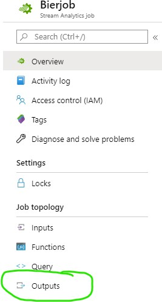
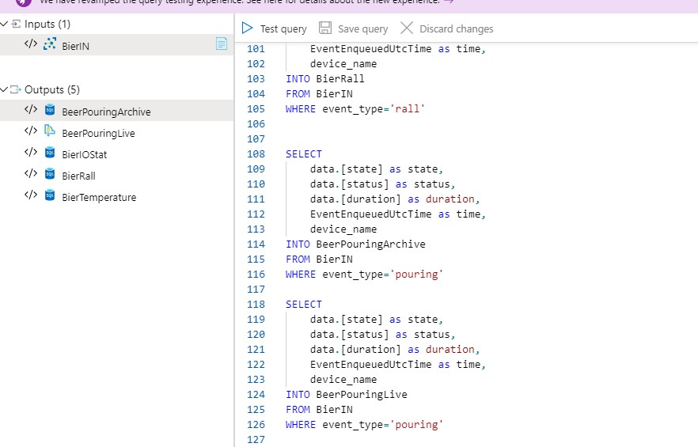

# Step 6 Extending the Stream Analytics job
Now that our Service Bus Queue is created, we need to make sure that the Stream Analytics Job is sending the events to the Service Bus Queue.
For that we will modify the existing Stream Analytics job that we created earlier in the reporting part of the workshop.

## Addinng the extra output(s) of the pouring events
The Beer Taps send what is called "Pouring" events, there are three events related to tapping 1 beer.
* Start Pouring
* Stop Pouring
* Duration of the Pouring

Let's store these events in the database as a cold path and add a hot path at the same time.
1. Go back to the previously created Stream Analytics Job.
2. Stop the Stream Analytics Job.
3. Click on **Outputs**

    

4. Click on **Add** and select *Service Bus Queue*
5. Fill in the following details:
      * **Outpus Alias**: A nice Alias for this Output, I would suggest to make the type of data part of the aliase. (_BeerPouringLive_ for example) *
      * **Susbcription**: You should have only 1 choice here "SBPE – SchubergPhilis – EVN"
      * **Service Bus Namespace**: The Namespace you created earlier (e.g. *tweaker-xxx* if you followed the example)
      * **Use existing queue**: Selected
      * **Queue**: Select the queue name from the dropdownlist. (e.g. *pouring_events* if you followed the example)
      * **All Other fields**: Leave Default value
      4. Click on **Add** and select *Service Bus Queue*
6. Click on **Add** and select *SQL Database*
7. Fill in the following details:
      * **Outpus Alias**: A nice Alias for this Output, I would suggest to make the type of data part of the aliase. (_BeerPouring_ for example)
      * **Subscription**: You should have only 1 choice here "SBPE – SchubergPhilis – EVN"
      * **Database**: The database that you created earlier.
      * **Username**: The username you filled in when you created the SQL Database
      * **Password**: Whatever password that belongs to this user.
      * **Table**: Fill in _BeerPouring_. Click on **Save**
9. Click on **Query**

    

10. Go to the qurey editor to add the output to the query
11. Scroll all the way to the bottom and add the content from the *stream_analytics_query_part2.sql* file that is found int he stream_analytics folder (keep in mind that it can be found in the Actioning main directory).

    

12. Click on **Save query**
13. Start the Job again.
