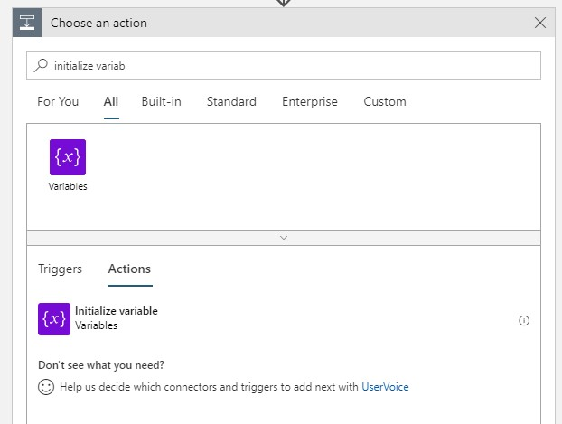
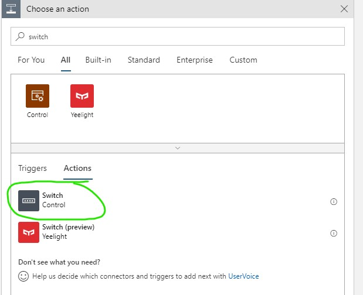
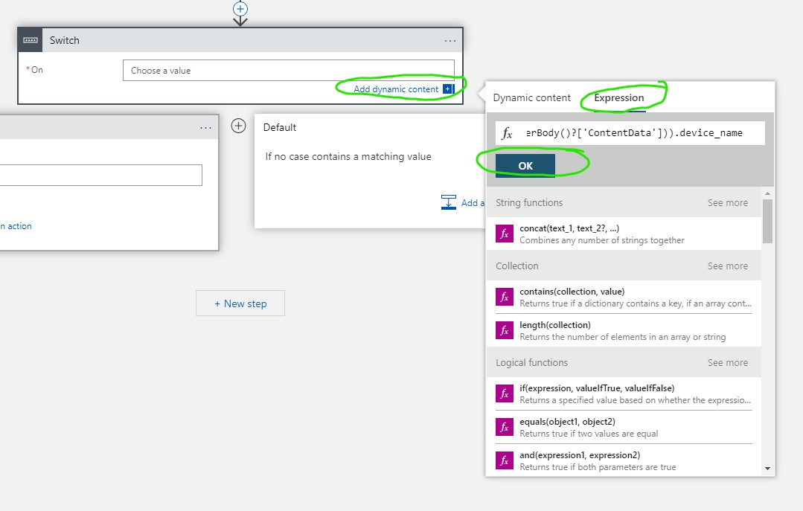
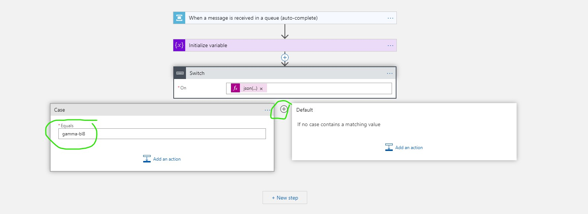
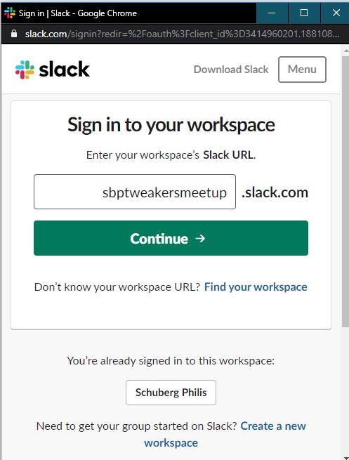
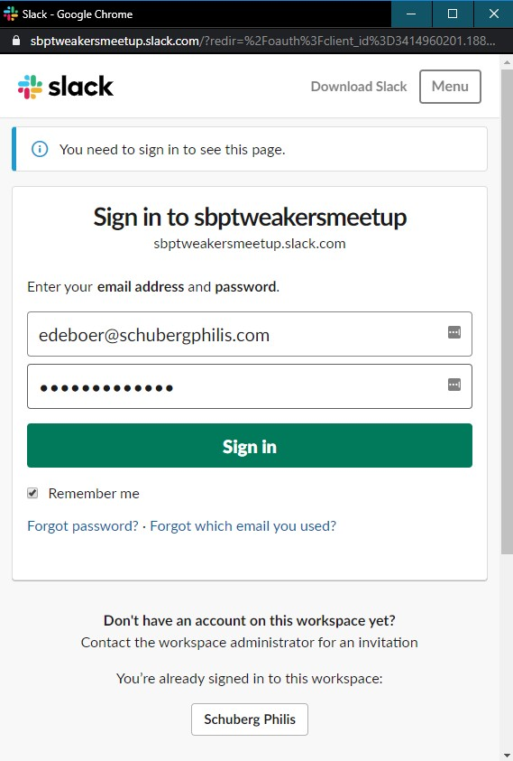
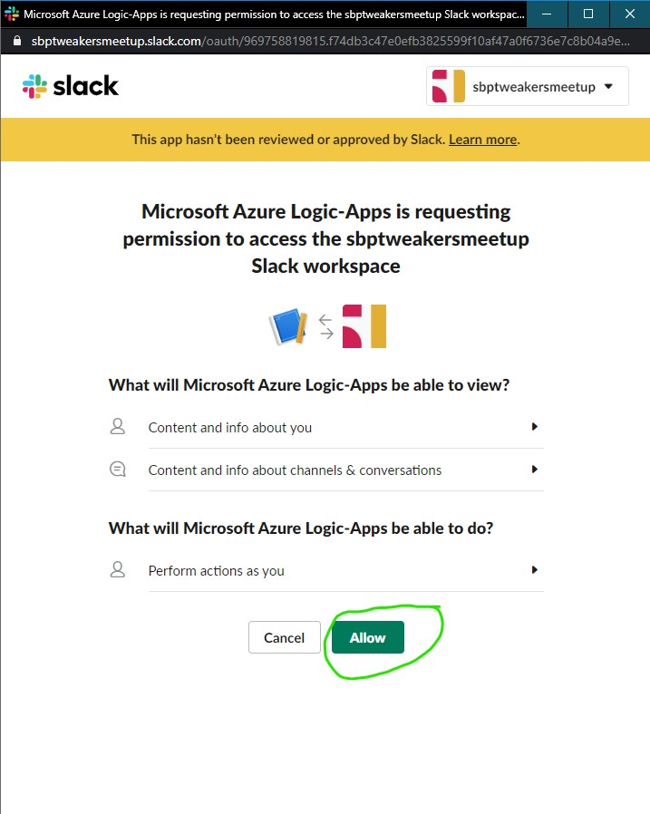
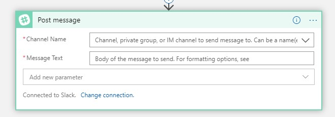
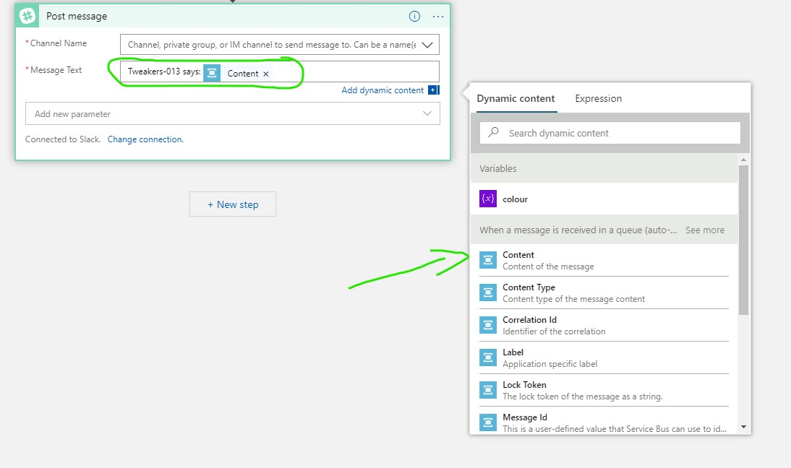
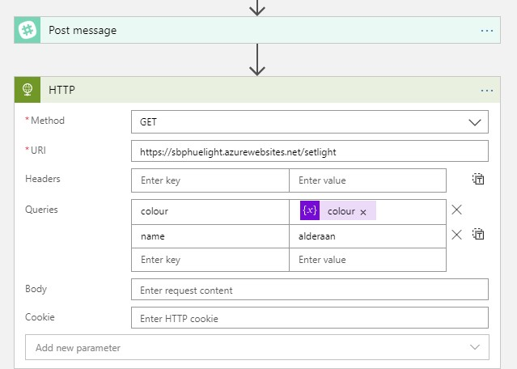

# Step 7 Creating a Logic App
Now that our pouring events are being sent to the Service Bus Queue, we need create something that consumes these events from the queue.
We will create a Logic App for that. A Locig App is a small workflow like application that can be triggered and based on that trigger perform several actions, like sending a slack message or changing the colour of a light bulb.

## Deploying the Logic App

1. Click on **Create a resource**.
2. Search the marketplace for "Logic App".

    

3. Fill in the following details:
  * **Subscription**: You should have only 1 choice here "SBPE – SchubergPhilis – EVN"
  * **Resource Group**: Your ResourceGroup (same number as the number in your username)
  * **Logic App name**: Come up with an Original name that you can easily find back.
  * **Select the Location**: Region
  * **Location**: West Europe
  * **Log Analytics**: Off
4. Click on **Review + create**
5. Wait untill the Logic App is deployed and then go to the deployed resource.
6. The Logic App is enabled by default, but this can have weird effects if you are modifying it at the same tim. So please **disable** the Logic App

    

## Create the actual Logic
1. From the Deployed Logic App **When a message is received in a Service Bus queue**

    

2. The Designer will probably suggest a service Bus for you. Make sure that it is the one YOU created. Click on the **...** to see if yours is listed, if not select **Add new connection**.
3. If you clicked on **Add new connection** in the previous step, fill in its details:
  * **Connection Name**: A unique name.
  * **Namespace**: Select the Namespace you created earlier
4. Select the Access Policy (there probably is one) and click on **Create**.

    

5. Click **Continue**
6. Fill in the Queue details:
  * **Queuer name**: The name you gave the queue you created earlier
  * **Queue type**: Main
  * **Interval**: 3
  * **Frequency**: second

    

7. Click on **New Step**
8. Now let's initialize a variable that we will set later on. In the searchbar type "initialize variable"  and select the **Initialize variable** activity

    

9. Give the Variable the name **colour** (mind the casing). The type is **String**. Leave the Initial value empty.
10. Click on **New Step**
11. The next action is a Switch (a.k.a. Case statement). In the sarchbar type "Switch" and select the **Switch(Control)** action. We will use this to change the colour based on the device that send the pouring event (alcholohic beer vs alcohol-free beer)

    

12. click on the **On** field and open the **Add dynamic content** context menu. In the Dynamic Content menu click on **Expression**.
13. Paste the following Expression in the Expression field:  *json(base64ToString(triggerBody()?['ContentData'])).device_name* and click on **OK**

    

14. A little bit on the left side of the Switch you see a **Case** with a field called **Equals**. Put the value *gamma-bl8* (alcohol-free) in the field
15. Now click on the little "+" icon on the right of the case statement 

    

16. In the second case statement fill the **Equals** field fill in *beta-bl8* (alcoholic).
17. Add an Action to the gamma-bl8 case. Find the **Set variable** action.
18. Select the **colour** variable we initialized earlier. Fill in a colour for the alcohol-free beer. (*green* for example).
19. Add an Action to the beta-bl8 case. Find the **Set variable** action.
20. Select the **colour** variable we initialized earlier. Fill in a colour for the alcoholic beer. (*red* for example).
21. Now that the colour variable is set, let's do our first action. Click on the little **+ New step** icon below **Case 2**.
22. In the searchbar search for "slack" and click on the **Post message** action. The Logic App Designer will now ask you to sign in to a slack organization. As mentioned at the start of the workshop, you can use the ***sbptweakersmeetup.slack.com*** workspace for this. Sign yourself up to the workspace if you haven't already.
    * Sign in to the **sbptweakersmeetup** slack workspace

      

    * Fill in your Credentials

      

    * Authorze the Logic App to post messages to THIS slack workspace on your behalf. (don't worry all authorizations are removed after the workshop)
    
      

23. If you succeeded on step 22, then you should now see this:

      

24. Fill in the following fields:
    * **Channel Name**: *#azure-iot* is the designated SPAM channel :P
    * **Message**: Type the text "Tweaker XXX sends: " (where XXX is your number). Then from the **add dynamic content** menu add **Content**

      

    * This will write the content of the pouring event messages to the slack channel, so that you can see what it looks like. Feel free to change this to something else later on.
25. Now would be a nice time to click on **Save**. In theory if you did everything correctly, you would now see soe slack messages when I tap a beer. (if nothing happens make sure your Logic App is enabled)
26. To do something with the colour variable we set earlier, we need to add a next action. In the searchbar type in "HTTP" and select the HTTP action (the plain HTTP one).
27. Set the following attributes.
    * **Method**: GET
    * **URI**: https://sbphuelight.azurewebsites.net/setlight
    * **Headers**: Leave default (empty)
    * **Queries**: add the following Key/Value pairs:
        * colour: Select the **colour** variable fro the **Add dynamic content** menu
        * name: The name of your Lamp (check the sticker on it)
    * **Body**: Leave default (empty)
    * **Cookie**: Leave default (empty)

    

28. Save the Logic App Again. In theory if you did everything correctly, you would now see some light bulbs change colour when I tap a beer. (if nothing happens make sure your Logic App is enabled)

This is the end of the workshop. Feel free to play around some more with the Grafana/Lights/Slack/Logic App etc.