# Step 7 Creating a Logic App
Now that our pouring events are being sent to the Service Bus Queue, we need create something that consumes these events from the queue.
We will create a Logic App for that. A Locig App is a small workflow like application that can be triggered and based on that trigger perform several actions, like sending a slack message or changing the colour of a light bulb.

## Deploying the Logic App

1. Click on **Create a resource**.
2. Search the marketplace for "Logic App".

    

3. Fill in the following details:
  * **Subscription**: You should have only 1 choice here "SBPE – SchubergPhilis – EVN"
  * **Resource Group**: Your ResourceGroup (same number as the number in your username)
  * **Logic App name**: Come up with an Original name that you can easily find back.
  * **Select the Location**: Region
  * **Location**: West Europe
  * **Log Analytics**: Off
4. Click on **Review + create**
5. Wait untill the Logic App is deployed and then go to the deployed resource.
6. The Logic App is enabled by default, but this can have weird effects if you are modifying it at the same tim. So please **disable** the Logic App

    

## Create the actual Logic

  + [Service Bus](#service-bus)
  + [Send to Slack](#send-to-slack)
  + [Parse Json](#parse-json)
  + [Switch on Event](#switch-on-event)
  + [Switch in a switch?](#switch-in-a-switch-)
  + [Add actions](#add-actions)
  + [Set the light](#set-the-light)
  + [Bonus task?](#bonus-task-)

### Service Bus

First step is to make sure the logic app is triggered when a new message arrives in the service bus queue. So lets hook up the logic app to a service bus.

1. From the Deployed Logic App **When a message is received in a Service Bus queue**

    

2. The Designer will probably suggest a service Bus for you. Make sure that it is the one YOU created. Click on the **...** to see if yours is listed, if not select **Add new connection**.
3. If you clicked on **Add new connection** in the previous step, fill in its details:
    * **Connection Name**: A unique name.
    * **Namespace**: Select the Namespace you created earlier
4. Select the Access Policy (there probably is one) and click on **Create**.

    

5. Click **Continue**
6. Fill in the Queue details:
    * **Queuer name**: The name you gave the queue you created earlier
    * **Queue type**: Main
    * **Interval**: 3
    * **Frequency**: second

    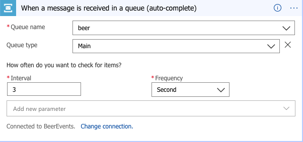

### Send to Slack

1. Click on **New Step**

    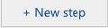

2. In the search bar search for `slack` and click on the **Post message** action. The Logic App Designer will now ask you to sign in to a slack organization. As mentioned at the start of the workshop, you can use the ***sbptweakersmeetup.slack.com*** workspace for this. Sign yourself up to the workspace if you haven't already.
    * Sign in to the **sbptweakersmeetup** slack workspace

      

    * Fill in your Credentials

      

    * Authorze the Logic App to post messages to THIS slack workspace on your behalf. (don't worry all authorizations are removed after the workshop)

      

3. If you succeeded on step 2, then you should now see this:

      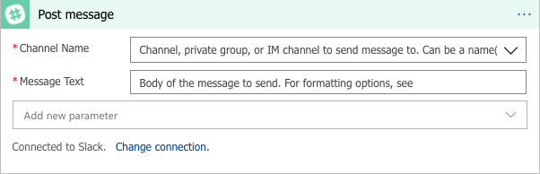

4. Fill in the following fields:
    * **Channel Name**: *#azure-iot* is the designated SPAM channel :P
    * **Message**: Type the text "Tweaker XXX sends: " (where XXX is your number).

    Then from the **add dynamic content** menu add **Content**

      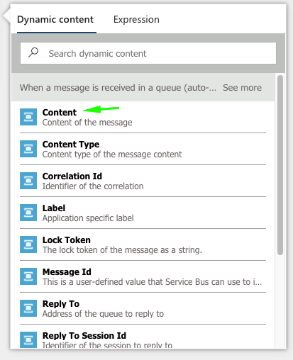

      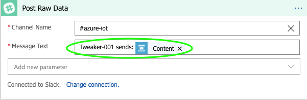

    * This will write the content of the pouring event messages to the slack channel, so that you can see what it looks like. Feel free to change this to something else later on.

Now would be a nice time to click on **Save**.

Our Logic app should now look like this.

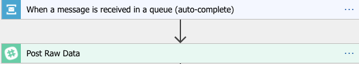

In theory if you did everything correctly, you should now see slack messages when I tap a beer. (if nothing happens make sure your Logic App is enabled)

### Parse Json

Oke so now that we know how the message looks like lets parse the json we get from the service bus. This way we can use the keys from the json in the rest of the logic app.

1. Click on **New Step**

    

2. In the search bar search for `parse json` and click on the **Parse Json** action from `data Operaions`.

    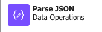

3. We need to apply some voodoo on the message content before we can parse it. The message from the service bus are base64 encoded so we need to reverse that. For that we use an expression in the content field with the following statement.
    ```
    json(base64ToString(triggerBody()?['ContentData']))
    ```
    `triggerbody()` returns the body of the action that initiated the logic app.<br>
    [ContentData](https://docs.microsoft.com/en-us/connectors/servicebus/#servicebusmessage) is the key where a service bus message stores it's data.

   For the schema we can use sample data from the message we send to slack.

### Switch on Event

1. Click on **New Step**

    

2. First let's initialize a variable that we will set later on. In the searchbar type "initialize variable"  and select the **Initialize variable** activity

    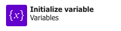

3. Give the Variable the name **colour** (mind the casing). The type is **String**. Leave the Initial value empty.

4. Click on **New Step**

    

5. The next action is a Switch (a.k.a. Case statement). In the searchbar type "Switch" and select the **Switch(Control)** action. We will use this to base our logic on the type of event. (started or stopped pouring beer?)

    

12. click on the **On** field and open the **Add dynamic content** context menu. In the Dynamic Content menu you can scroll and see the content that has been added to the workflow from the `Parse Json` step. One of values there should be `state`

    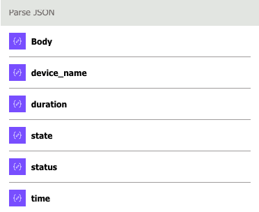

14. A little bit on the left side of the Switch you see a **Case** with a field called **Equals**. Put the value `started` in the field.

    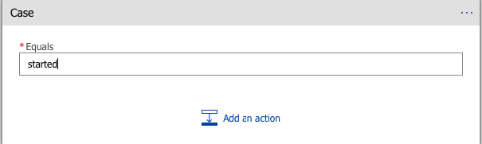

15. Now click on the little "+" icon on the right of the case statement and repea this for our next case `stopped`

Now at the end of this our switch should look like this

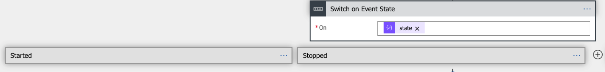

### Switch in a switch?

Now we have a flow for when we started and when stopped pouring beer. The next thing we need to know is what kind of beer is being poured. We decide this by the name of the blade that is sending the data.

  * `Non-Alcoholic `: gamma-bl8
  * `Alcoholic`: beta-bl8

So inside of the `Started` case make a new switch condition but this time base it on `device_name`
Reach out out if you need help with this!

### Add actions

We now should have all the different flow we need to change the colour when someone starts to pour beer based on the type of beer and to turn it back once we stop.

1. Inside the case statement of the Alcoholic beer add a **Set variable** action.

    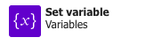

2. Select the **colour** variable we initialized earlier. Fill in a colour for the alcohol-free beer. (*blue* for example).

3. Repeat the same for the Non-Alcoholic case statement. (*green* for example).

4. Repeat the same for the Stopped case statement. Set the colour to white here to change the lamp back to neutral when the pouring stops.

### Set the light

Now that the colour variable is set, let's send some commands to the hue bridge.

1. Click on **New Step**. (you should know where to find this by now `;)`)

    

2. To do something with the colour variable we set earlier, we need to add a next action. In the searchbar type in "HTTP" and select the HTTP action (the plain HTTP one).

27. Set the following attributes.
    * **Method**: GET
    * **URI**: https://sbphuelight.azurewebsites.net/setlight
    * **Headers**: Leave default (empty)
    * **Queries**: add the following Key/Value pairs:
        * colour: Select the **colour** variable fro the **Add dynamic content** menu
        * name: The name of your Lamp (check the sticker on it)
    * **Body**: Leave default (empty)
    * **Cookie**: Leave default (empty)

    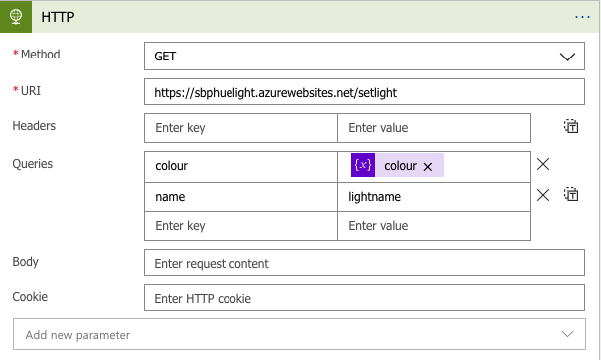

Save the Logic App Again. In theory if you did everything correctly, you would now see some light bulbs change colour when I tap a beer. (if nothing happens make sure your Logic App is enabled)

### Bonus task?

As a bonus we have 1 workflow we didn't touch yet. We still have the default workflow of the initial switch based on event. If you look close in slack you see there there is another event being send other then started/stopped. Let's see if oyu can format the slack message in the "Default" case to something on how long a beer was poured

The JSON Code of the Logic App (how it should be) can be found in the *logic_app* directory in the file **logic_app.json**. If you are using this one, make sure to change/remove/recreate the parameters for the Service Bus Queue and Slack integration starting on Line 125.

This is the end of the workshop. Feel free to play around some more with the Grafana/Lights/Slack/Logic App etc.
