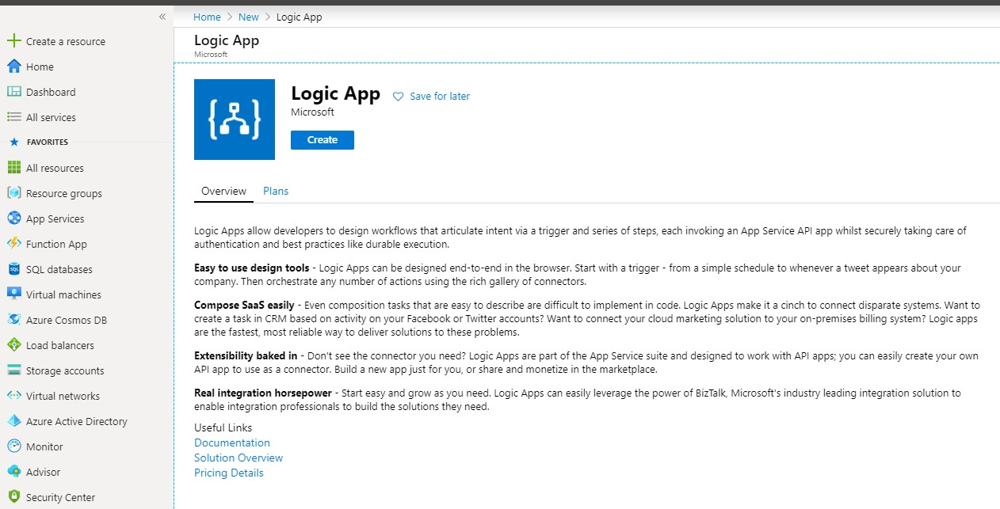
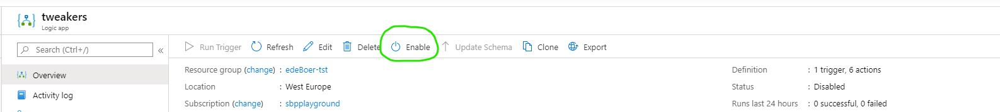
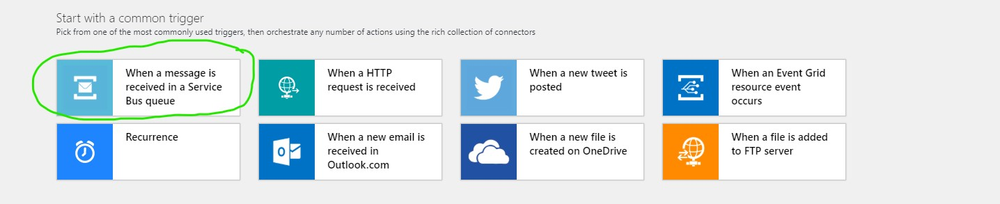
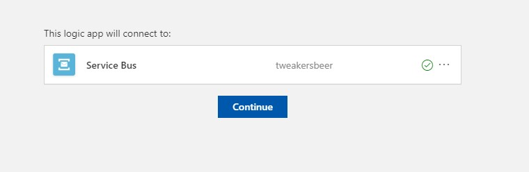
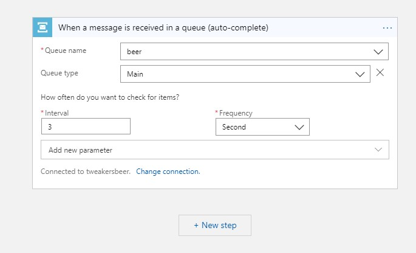

# Step 7 Creating a Logic App
Now that our pouring events are being sent to the Service Bus Queue, we need create something that consumes these events from the queue.
We will create a Logic App for that. A Locig App is a small workflow like application that can be triggered and based on that trigger perform several actions, like sending a slack message or changing the colour of a light bulb.

## Deploying the Logic App

1. Click on **Create a resource**.
2. Search the marketplace for "Logic App".

    

3. Fill in the following details:
  * **Subscription**: You should have only 1 choice here "SBPE – SchubergPhilis – EVN"
  * **Resource Group**: Your ResourceGroup (same number as the number in your username)
  * **Logic App name**: Come up with an Original name that you can easily find back.
  * **Select the Location**: Region
  * **Location**: West Europe
  * **Log Analytics**: Off
4. Click on **Review + create**
5. Wait untill the Logic App is deployed and then go to the deployed resource.
6. The Logic App is enabled by default, but this can have weird effects if you are modifying it at the same tim. So please **disable** the Logic App

    

## Create the actual Logic
1. From the Deployed Logic App **When a message is received in a Service Bus queue**

    

2. The Designer will probably suggest a service Bus for you. Make sure that it is the one YOU created. Click on the **...** to see if yours is listed, if not select **Add new connection**.
3. If you clicked on **Add new connection** in the previous step, fill in its details:
  * **Connection Name**: A unique name.
  * **Namespace**: Select the Namespace you created earlier
4. Select the Access Policy (there probably is one) and click on **Create**.

    

5. Click **Continue**
6. Fill in the Queue details:
  * **Queuer name**: The name you gave the queue you created earlier
  * **Queue type**: Main
  * **Interval**: 3
  * **Frequency**: second

    

