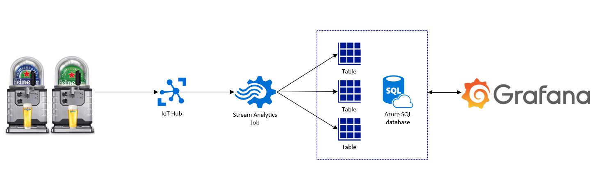

# Reporting  on IoT data

In this part we will make a dashboard that can report on the data from the Beer Blades (let's call them Taps from now on). Think about metrics like Temperature of the beer keg, the volume of the beer keg, ambient temperature, air pressure etc.

What services in Azure are Used:
- IoT-Hub
- Azure Stream Analytics Job
- SQL DB (SQL-Server)
- ~~PowerBI~~ (PowerBI didn't make the workshop, needed accounts for everybody and realtime was only in paid subscription)
- Grafana (Open Source Dashboard/reporting tool as an alternative for PowerBI)
- Supporting services (like VNET's, storage accounts etc.)

## Small Architecture sketch

## Setup per table
Each Table has its own resource group with all the per-table shared azure resources (e.g. IoTHub and Grafana)
You can find credentials that you can use to login to portal.azure.com on each table.
Please do not deploy additional IoT Hubs, as they won't be able to receive data from the Beer taps. Each deployed IoT Hub needs to be configured on the Beer Taps and the ones we deployed have been configured on our Beer Taps.

## Setup per Workshop attendeed
Each workshop attendee wil also receive an own Resource group in which he/she can deploy the neccesary resources. The resource group that belongs to you can be found on the table as well.
Please do not deploy things to resource groups that are not your own. Thank you on behalf of your fellow workshop mates for understanding ;)

## What You will Create
1. A Consumergroup for yourself on the IoT Hub of your table.
2. A SQL DB and create the tables (we have a script for the tables ;) )
3. A Stream Analytics Job and configure the Inputs and Outputs
4. A Dashboard in Grafana (SQL Queries to get some nice data are available)

