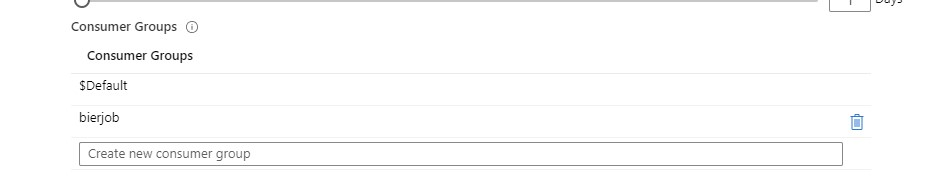
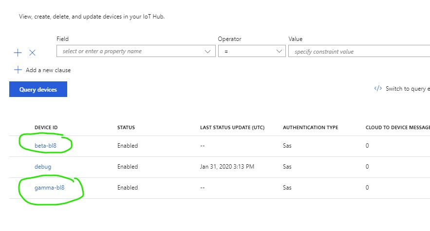

# Step 1: IoT Hub Deployment and Configuration

For this workshop we have already deployed an IoT Hub in Azure for each table in the room. We pre-deployed the IoT Hub, because deploying it in Azure can take some time.

## Configuration of the IoT Hub

1. Go to your table's IoT Hub in the Azure Portal
2. In the lefthand menu find "Built-in endpoints"
3. You will there see a Section "Consumer Groups"
4. Create a Consumer group for yourself, feel free to come up with a nice unique name next to the default one ($Default).

5. Please confirm in the IoT Devices screen that the Beta (normal heineken) and Gamma (heineken 0.0) blades are registered.

