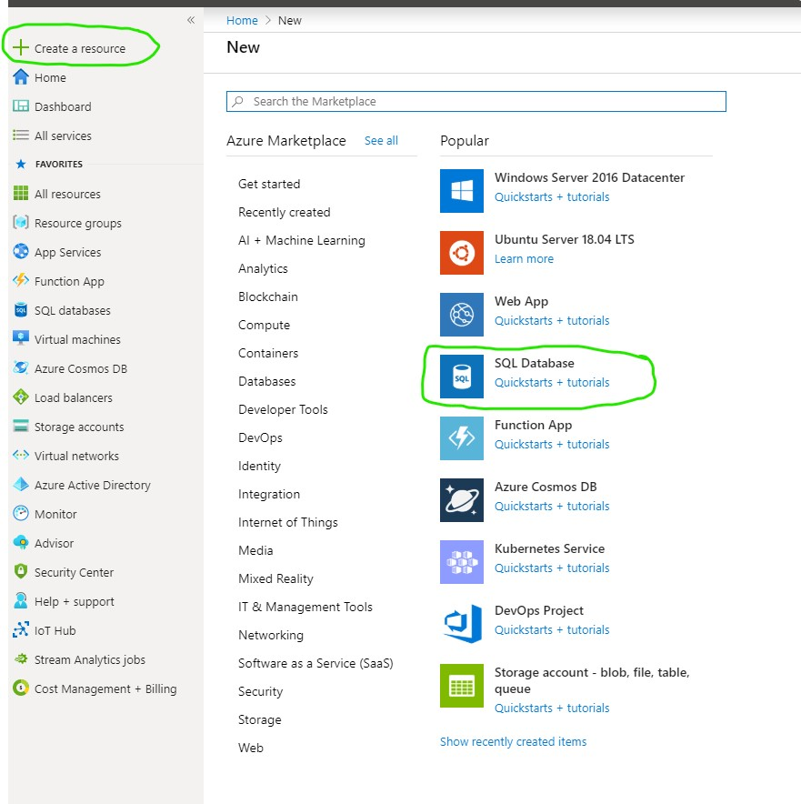
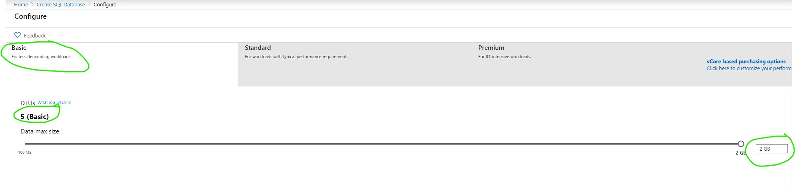
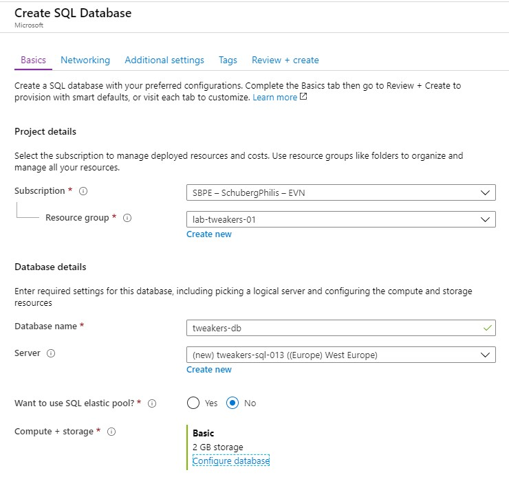
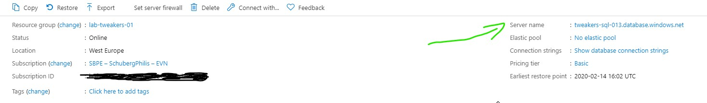
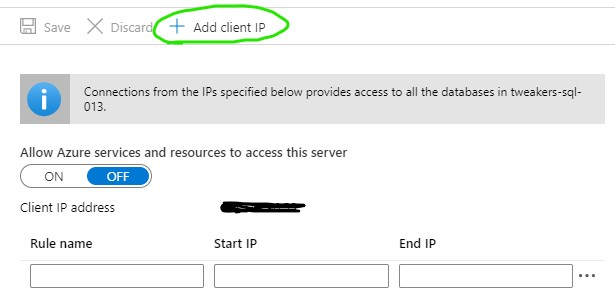
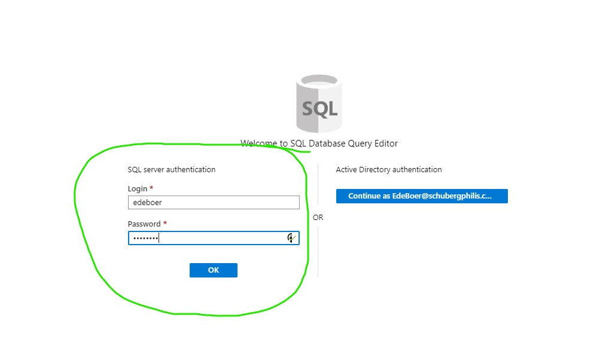
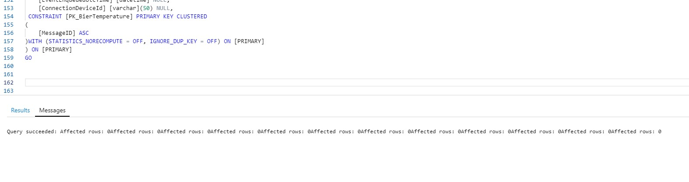

# Step 2: Create an Azure SQL DB (and SQL Server)
For this part of the workshop we will use Azure SQL DB as an Output for the Stream Analytics Job. This Database and server are not pre-deployed for you, so let us do that now.

## Bonus: Why we chose SQL Server as Output for this workshop
As we are going to use Grafana to visualize the data, the more obvious choise would be an InfluxDB or something like that. However Azure Stream Analytics does not support InfluxDB as an output.
If we would want to go for InfluxDB, we would need something like Azure Databricks or an container running some code between the IoT-Hub and the InfluxDB. Where Databricks is way more expensive just for this workshop. We could also choose for Cosmos DB, which also supports timeseries. However Grafana doesn't support Cosmos DB. Besides that I have more experience with SQL, so it was easier to put together.

## Creating the database (and server at the same time)
1. Click on __Create a resource__
2. Select __SQL Database__

3. Fill in the following details:
   * **Subscription**: You should have only 1 choice here "SBPE – SchubergPhilis – EVN"
   * **Resource Group**: Your ResourceGroup (same number as the number in your username)
   * **Database name**: Choose a database name (suggestion *tweakers_db*), remember it well you need it later!
   * **Server**: Click on __Create new__
      * **Server name**: Pick a Servername that you can remember (suggestion: *tweakers-sql-[number in your username] e.g. tweakers-sql-013*)
      * **Server admin login**: Pick a username, remember it we will use it later on!
      * **Password**:  Fill in a [password](https://docs.microsoft.com/en-us/sql/relational-databases/security/password-policy?view=sql-server-ver15) that you can remember.
      * **Location**: Please use __(Europe) West Europe__
   * **Want to use SQL elastic pool?**: No
   * **Compute + Storage**: Click on __Configure Database__
      * _You are only allowed to deploy Basic DTU based SQL Servers, this is to save us €€€ and maybe do this more often_
      * In the configuration screen click on **Looking for basic, standard,premium?**
      * Select **Basic** and click **Apply** (The 2GB database is good enough for this workshop)

      

    * Now Click on **Review + create**

     

    * Wait untill the database and server are deployed before continuing.
    * When it is deployed click on *Go to Resource*

## Creating the Tables
For the Tables we have provided a script for you. You can find it in the subfolder **SQL**. You don't have to come up with all the SQL code yourself ;). However if you want to use more of the fields from the json messages, feel free to add columns or even tables (if you know what you are doing ;) ).
Lets run the script!

### Granting access from your IP Address
First we will need to allow our IP address access to the server/database. Even though we will use the built in Query editor on the Azure Portal, it still assumes the connection is from your client's IP address and not an Azure IP Address.

1. On the Overview page of your newly deployed Database find the server name and click on it.

      

2. Click on the *Firewalls and virtual networks* entry in the lefhand menu.

      

3. Click on *Add client IP*. This will add the IP Address that Azure sees you coming from. Thus allowing you to conect to the sql server/database. Now Click on *Save*

      

### Open the Query Editor
Now that we allowed ourselves to access the sql database from our wifi network, let's create the actual tables.

1. Go to the Database that you created earlier.
2. From the Overview screen click on *Query Editor (preview)*.

      

3. It will ask you for credentials. Use the Username and Password that you created when you deployed your database. (for this workshop we will ignore this security concern :P )

      

4. Open the file ***create_tables.sql*** you can find it in the subfolder called ***SQL*** in this repo.
5. Copy the contents and paste them it in the Query 1 editor screen and click on ***Run***.

      

6. The output should look something like this:

      
