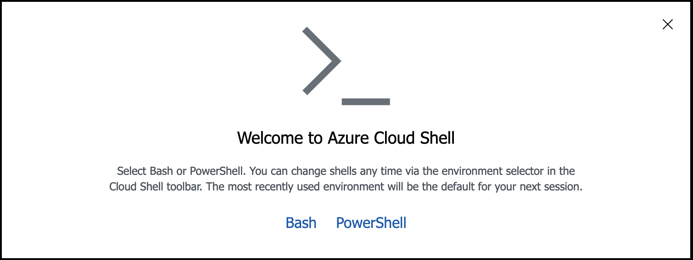
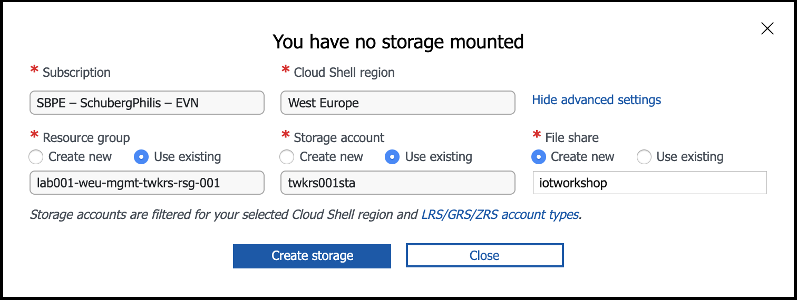
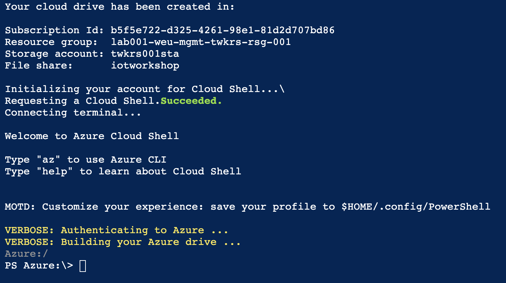

# Support during IoT Workshop

If during the workshop you get stuck and start to feel you are left behind there are SBP engineers walking around to support you. You can recognize them by the black SBP shirts and a blue badge ;)

If you cannot find anyone who is free to support you we have created scripts to help you catch up to the workshop. These can be executed in the Azure Cloud Shell.

To begin with, if you haven’t used Cloud Shell before, you will need to setup it up for the first time. When you open the shell for the first time in the Azure portal, the dedicated Cloud Shell site or even in Visual Studio Code, you will be prompted to configure the storage and the resource group where Cloud Shell will be hosted.

## Start Cloud Shell

1. Click on **Cloud Shell** button from the top navigation bar of the Azure portal

    

    Choose powershell for this workshop.

    

2. Select the advanced settings. This will allow you to select an existing resource group and storage account as well specify the Azure File Share.

    - `resource group`: lab001-weu-mgmt-iot-rsg-<assigned number>
    - `storage account`:  twkrs<assigned number>sta
    - `share`: iotworkshop

    

    ---
    **NOTE**

    Make sure you select the Cloud Shell region `West Europe`

    ---

3. Select the PowerShell environment from the drop-down and you will be in Azure drive `(Azure:)`

   

There you go you can now regular PowerShell commands in the Cloud Shell, such as:

```powershell
PS Azure:\> Get-Date

# Expected Output
Friday, July 27, 2018 7:08:48 AM
```

To find the helper script created for the workshop type the following

```powershell
PS Azure:\> cd $home/$env:user/clouddrive/scripts

PS /home/<assigned number>/clouddrive/Scripts> ls -R | grep ":$"

.:
./1_iothub:
./2_sql_database:
./3_azure_stream_analytics:
./4_grafana:
./5_create_servicebus_queue:
./6_extend_stream_analytics_job:

```

If you are unsure how to execute one of the scripts you can do the following

```
PS > Get-Help ./New-IotConsumerGroup.ps1 -Detailed

NAME
    ./New-IotConsumerGroup.ps1

SYNOPSIS
    Helper script for IoT Hub Configuration.

SYNTAX
    ./New-IotConsumerGroup.ps1 [-username] <String> [-consumerGroupName] <String> [<CommonParameters>]

PARAMETERS
    -username <String>
        Event Azure username assigned (tweaker-###) does not need the @...

    -consumerGroupName <String>
        Name of the IOT EventHub ConsumerGroup that you want to add.

    -------------------------- EXAMPLE 1 --------------------------

    PS > ./New-IotConsumerGroup.ps1 -username tweaker-001 -consumerGroupName myConsumerGroup

```
